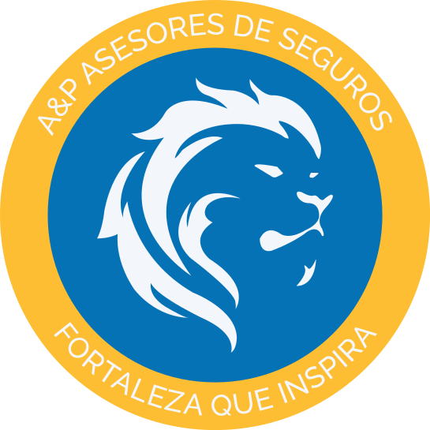

# A&P Asesores App

Esta es una aplicación web para A&P Asesores.


## Descripción

La aplicación web proporciona funcionalidades para cotizar seguros, administrar pólizas y obtener información sobre los servicios de A&P Asesores.

# FRONTEND

## Instrucciones de Ejecución

1. Clona este repositorio en tu máquina local:

```bash
   git clone <>
```

2. Accede al directorio del proyecto:

```bash
cd frontend
```

3. Instala las dependencias necesarias utilizando npm:

```bash
npm install
```

4. Inicia la aplicación en modo de desarrollo:

```bash
npm run dev
```

5. Abre tu navegador web y accede a [http://localhost:3000](http://localhost:3000) para ver la aplicación en funcionamiento.

## Dependencias

- React.js
- React Router
- Chart.js
- Tailwind CSS

# BACKEND

# Backend de Django para [Nombre del Proyecto]

Este repositorio contiene el código fuente del backend de un proyecto web desarrollado con Django.

## Requerimientos

Asegúrate de tener instalado lo siguiente antes de ejecutar el proyecto:

- Python >= 3.12
- Django == 5.0.1
- Otros requisitos especificados en el archivo `requirements.txt`

## Instalación

1. Clona este repositorio en tu máquina local:

   ```bash
   git clone
   ```

2. Navega al directorio del proyecto:

   ```bash
   cd tu_repositorio
   ```

3. Instala las dependencias usando pip:

   ```bash
   pip install -r requirements.txt
   ```

## Configuración

1. Crea y configura un entorno virtual (opcional pero recomendado).

2. Copia el archivo `.env.example` y renómbralo a `.env`. Ajusta las variables de entorno según sea necesario.

## Ejecución

Para ejecutar el servidor de desarrollo de Django, sigue estos pasos:

```bash
python manage.py runserver
```

## Autores

- AXEL PULLAGUARI 😶‍🌫️

## Licencia

Este proyecto está bajo la Licencia MIT.
